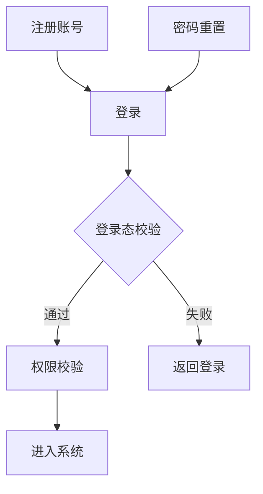
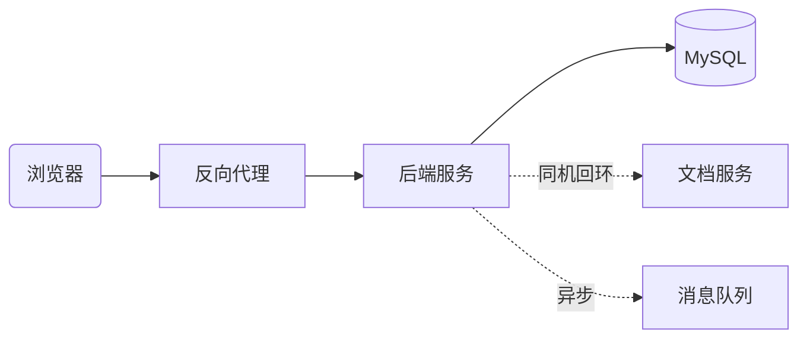
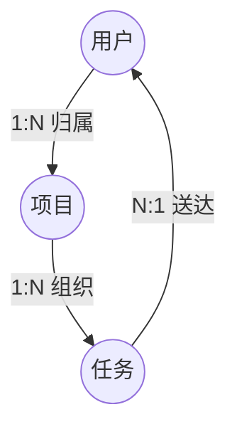
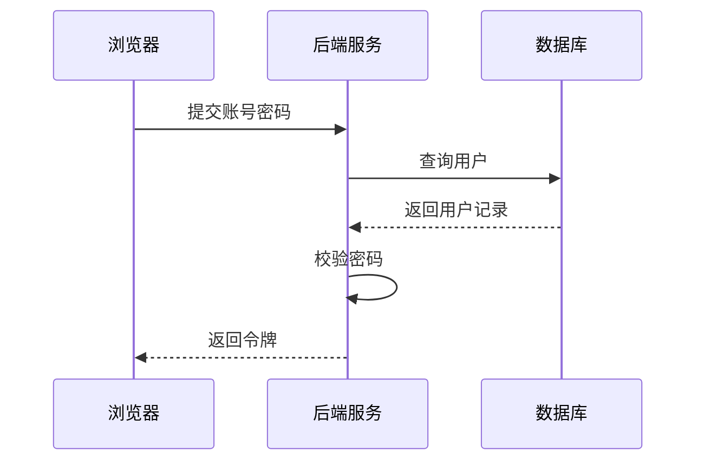
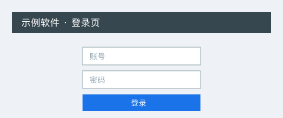

# 业务流程图

本文档覆盖 mdany 支持的全部 mermaid 子集写法。

## 登录流程（方框、菱形、边标签）

```mermaid
flowchart TD
    A[注册账号] --> B[登录]
    B --> C{登录态校验}
    C -->|通过| D[权限校验]
    C -->|失败| E[返回登录]
    D --> F[进入系统]
    G[密码重置] --> B
```

## 系统架构（横向、链式边、圆柱、点线边）

```mermaid
flowchart LR
    U(浏览器) --> P[反向代理] --> API[后端服务]
    API --> DB[(MySQL)]
    API -.同机回环.-> DOC[文档服务]
    API -.-> |异步| MQ[消息队列]
```

## 数据关系（圆形节点）

```mermaid
flowchart TD
    %% 注释行会被忽略
    USER((用户)) -->|1:N 归属| PROJ((项目))
    PROJ -->|1:N 组织| TASK((任务))
    TASK -->|N:1 送达| USER
```

## 登录时序（时序图）

```mermaid
sequenceDiagram
    participant B as 浏览器
    participant S as 后端服务
    participant D as 数据库
    B->>S: 提交账号密码
    S->>D: 查询用户
    D-->>S: 返回用户记录
    S->>S: 校验密码
    S-->>B: 返回令牌
```

## 截图

